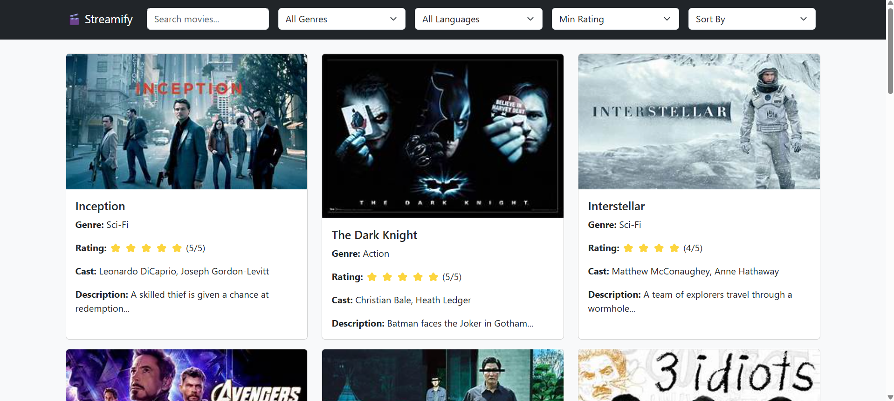

# Streamify



A modern movie streaming web application built with **React.js** and **Bootstrap**, featuring a dynamic carousel and a responsive movie list.

##  Features
-  Display a list of movies with posters, genres, and ratings
-  Carousel highlighting featured movies
-  Fully responsive design using Bootstrap
-  Optimized for fast loading with lazy image loading

## Tech Stack
- **Frontend:** React.js, Bootstrap
- **State Management:** useState, useEffect
- **Styling:** Bootstrap, Custom CSS


## Installation & Setup

Follow these steps to set up the project locally:

1. **Clone the repository**
   ```bash
   https://github.com/SrikanthMidathapalli/Streamify.git
   cd streamify
   ```

2. **Install dependencies**
   ```bash
   npm install
   ```

3. **Start the development server**
   ```bash
   npm start
   ```

4. **Access the application**
   Open [http://localhost:3000](http://localhost:3000) in your browser.

## Usage
- Browse the movie list and explore details
- Navigate through the carousel to view featured movies
- Responsive UI for both desktop and mobile

